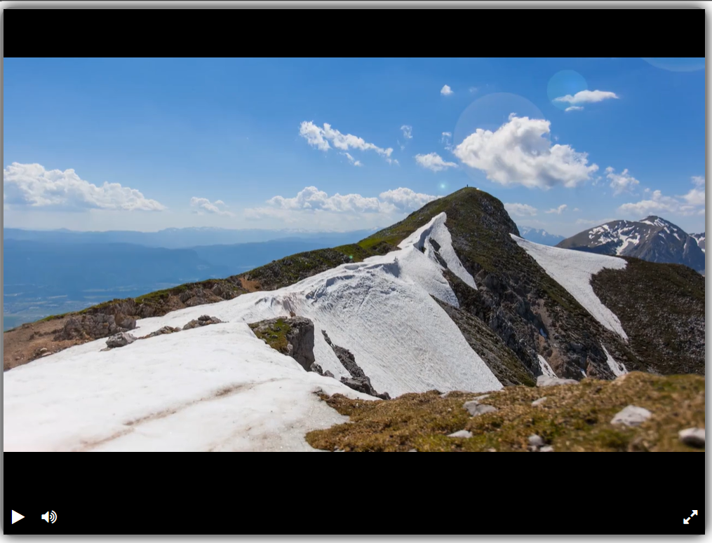

# Видеоплеер
## Скриншот

Этот файл (`video.html`) содержит полностью рабочий кастомный видеоплеер, построенный на библиотеке **Playable.js**. Все кнопки управления уже привязаны к методам плеера через `player.js`.

## Что внутри
- `video.html` – разметка и стили плеера.
- `player.js` – логика (управление воспроизведением, звуком, полноэкранным режимом).  
  Он уже написан и лежит рядом.

## Как запустить
1. Убедись, что `player.js` находится в той же папке, что и `video.html`.
2. Открой `video.html` в браузере – плеер готов к работе.

## Управление
-  Play – начать видео  
-  Pause – поставить на паузу  
-  Mute – выключить звук  
-  Volume – включить звук  
-  Fullscreen – полноэкранный режим
